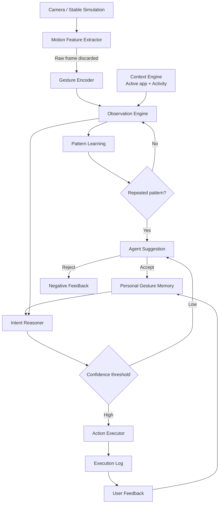

# 서비스 아키텍처

## 1. 전체 구조



## 2. 구현 모듈

```text
Perception input
  ├─ Stable simulation UI
  └─ Optional OpenCV optical-flow client
          ↓
Gesture Encoder
          ↓
Observation + Context API
          ↓
Pattern Learning Service
          ↓
Suggestion + Personal Gesture Memory
          ↓
Intent Reasoner
          ↓
Dry-run / OS Action Executor
          ↓
Feedback Service
```

## 3. Agent가 개입하는 지점

Agent는 제스처를 곧바로 명령으로 변환하지 않습니다.

```text
Gesture + Context + Personal History
             ↓
     Candidate Memory Search
             ↓
        Confidence Score
             ↓
  High: automatic execution
  Low:  no execution / user teaching
             ↓
          Feedback
             ↓
       Memory update
```

## 4. Context-aware memory

개인 기억의 기본 키는 다음 조합입니다.

```text
User + Gesture representation + Context scope = Intent
```

예시:

```text
나영 + swipe:right + presentation = NEXT_SLIDE
나영 + swipe:right + music        = NEXT_TRACK
```

## 5. 개인정보 처리 경계

- 카메라 프레임은 메모리에서 모션 계산에만 사용
- `cv2.imwrite`, 동영상 녹화, 프레임 API 업로드 없음
- DB 저장 데이터: motion type, direction, duration, embedding, context, 후속 행동
- 얼굴 특징·신원 특징 없음
- 자동 실행은 승인된 `ACTIVE` memory만 대상

## 6. 구현 보강 사항

제공 기획의 최종 관계도에는 `Execution`이 포함되어 있으나 별도 필드 정의는 없습니다. 실제 구현에서는 실행 결과와 피드백을 감사 가능하게 연결하기 위해 `executions` 테이블을 추가했습니다.
