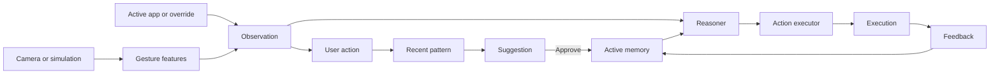

# 서비스 아키텍처

규칙은 [SPEC](../spec.md), 데이터 제약은 [ERD](erd.md)가 소유합니다.

## 흐름

카메라 프레임은 특징 계산 뒤 폐기합니다. Windows 관측 모드는 같은 앱의 실제 후속 키를 Observation에 연결하고, 시뮬레이션은 행동을 명시적으로 선택합니다.

## 코드 위치

| 책임 | 위치 |
|---|---|
| API·Context | `backend/src/silent_orchestra/routers/agent.py`, `services/context_resolver.py` |
| 학습·제안·승인 | `services/pattern_learning.py`, `services/confirmation.py` |
| 특징·추론 | `services/gesture_encoder.py`, `services/intent_reasoner.py` |
| 실행·피드백 | `services/action_executor.py`, `services/feedback_service.py` |
| 데이터·설정 | `models.py`, `schemas.py`, `database.py`, `config.py` |
| 데모 초기화 | `routers/demo.py`, `services/demo_service.py` |
| 카메라 | `frontend/app.js`, `backend/scripts/webcam_gesture_client.py` |
| UI | `frontend/index.html`, `app.js`, `styles.css`, `tokens.css` |

백엔드는 `routers/`와 `services/` 두 계층을 유지합니다. 선택 기능이 실제로 늘기 전에는 추가 추상화하지 않습니다.
