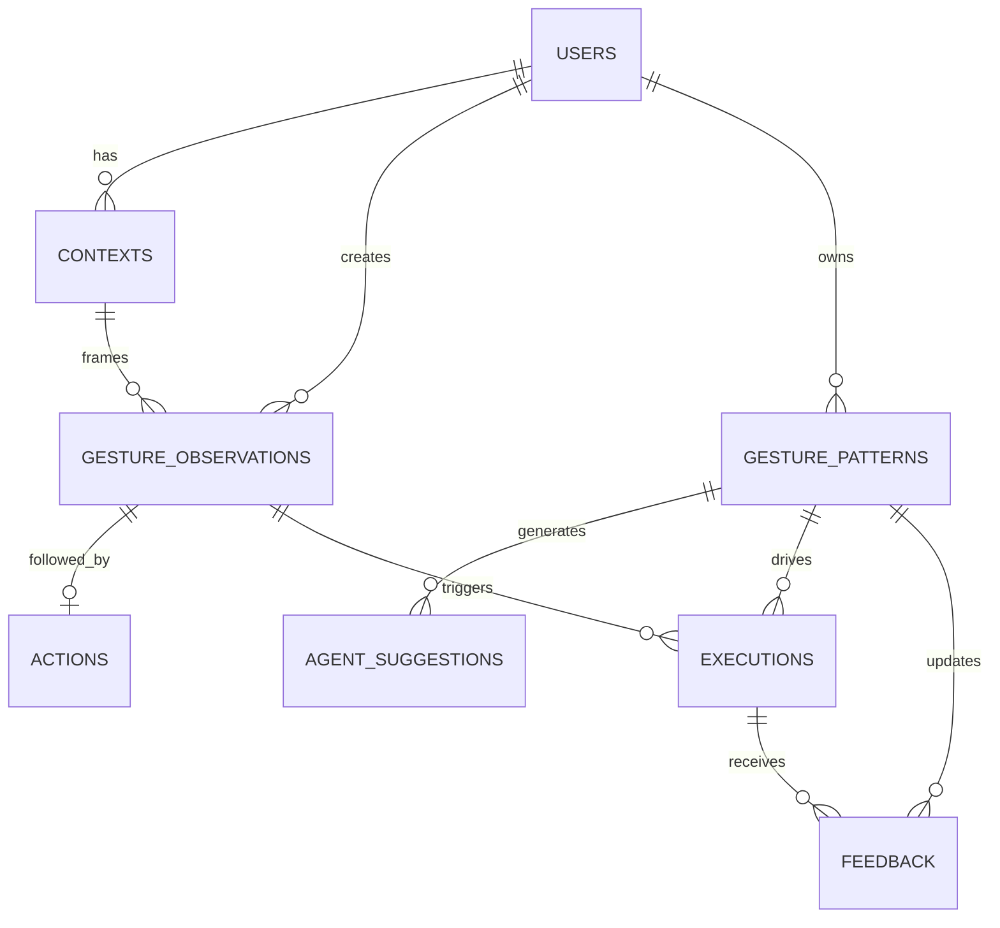

# ERD 및 데이터 설계

## 1. 관계도

## 2. 테이블 역할

| 테이블 | 역할 | 핵심 보존 데이터 |
|---|---|---|
| `users` | 개인화 기억의 소유자 | 사용자 식별자, 이름 |
| `contexts` | 몸짓 발생 당시 상황 | active app, activity, space, device |
| `gesture_observations` | AI가 관찰한 원시 행동 이벤트 | embedding, motion, direction, duration |
| `actions` | 몸짓 직후 사용자가 수행한 행동 | action type, target, parameters |
| `gesture_patterns` | Personal Gesture Memory 후보·활성 기억 | intent, context scope, confidence, count |
| `agent_suggestions` | Agent가 사용자에게 제시한 학습 제안 | reason, confidence, status |
| `executions` | 승인된 기억의 실행 감사 로그 | intent, result, mode, error |
| `feedback` | 실행에 대한 사용자 평가 | correct, wrong, accidental, ignore |

## 3. 핵심 제약조건

- `gesture_observations.frame_stored = 0`만 허용
- 모든 confidence는 `0.0~1.0`
- `actions.observation_id`는 UNIQUE: 하나의 관찰 이벤트에 한 후속 행동
- 개인 기억은 `(user, gesture_key, context_scope, intent)` 기준 UNIQUE
- 승인 전 pattern 상태는 `CANDIDATE`, 승인 후 `ACTIVE`
- 모든 사용자 종속 데이터는 사용자 삭제 시 CASCADE
- Context activity와 suggestion/feedback status는 CHECK 제약조건으로 제한

## 4. 인덱스

- 관찰 검색: `(user_id, gesture_key)`
- 기억 추론: `(user_id, context_scope, status)`
- 제안함: `(user_id, status)`
- 실행 로그: `(user_id, executed_at)`
- 피드백 분석: `(gesture_pattern_id, created_at)`

## 5. Privacy 설계

`gesture_embedding`은 모션 특징 벡터이며 원본 영상이 아닙니다. DB에는 frame 파일 경로, 이미지 BLOB, 얼굴 embedding 열을 두지 않습니다. 추가로 `frame_stored` CHECK를 사용해 잘못된 저장 시도도 DB 레벨에서 차단합니다.

## 6. SQL 파일

- `sql/schema.sql`: DDL, 제약조건, 인덱스, view
- `sql/seed.sql`: 맥락별 동일 제스처 샘플
- `sql/queries.sql`: 앱·분석 대표 쿼리
- `sql/tests.sql`: 무결성 assertion
- `sql/validation-report.json`: 실제 실행 검증 결과
