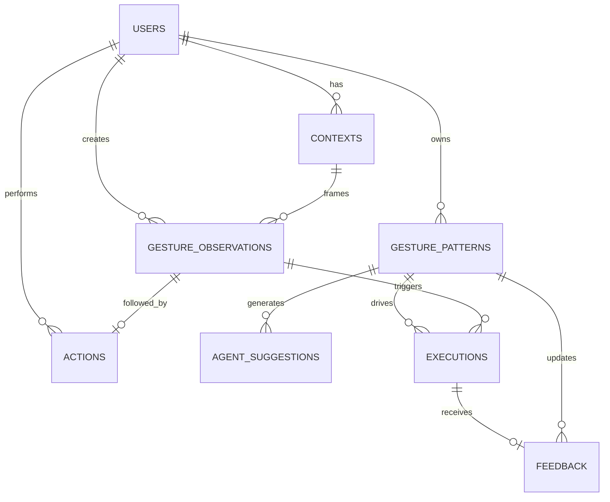

# 데이터 설계

컬럼의 원본은 [schema.sql](../backend/sql/schema.sql), 규칙은 [SPEC](../spec.md)입니다.

| 테이블 | 역할 |
|---|---|
| `users` | 기억 소유자 |
| `contexts` | 관찰 시점의 앱·활동·공간·기기 |
| `gesture_observations` | 모션·방향·시간·embedding·선택적 속도/진폭 |
| `actions` | 사용자의 후속 행동 |
| `gesture_patterns` | 후보·활성 기억 |
| `agent_suggestions` | 학습 제안과 응답 |
| `executions` | 실행 결과 감사 로그 |
| `feedback` | 실행 평가 |

`space`·`device`는 메타데이터이고 학습 단위는 `activity`입니다. `speed`와 `amplitude`는 함께 NULL이거나 함께 값이 있어야 합니다. 원본 영상 컬럼은 없습니다.

SQL 산출물은 `backend/sql/{schema,seed,queries,tests}.sql`이며 검증 명령은 [README](../README.md#테스트)에 있습니다.
